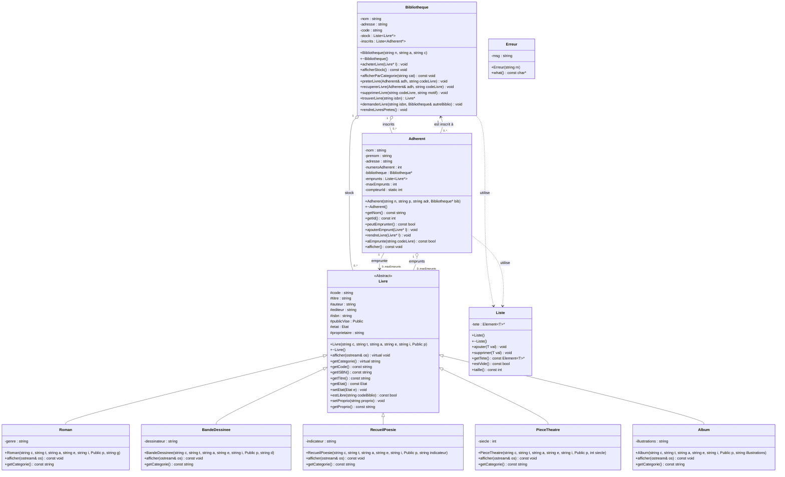

```mermaid
classDiagram
    %% Relations générales
    Bibliotheque "1" o-- "0..*" Adherent : inscrits
    Bibliotheque "1" o-- "0..*" Livre : stock
    Adherent "0..*" --> "1" Bibliotheque : est inscrit à
    Adherent "1" --> "0..maxEmprunts" Livre : emprunte
    Adherent "1" o-- "0..maxEmprunts" Livre : emprunts
    
    %% Dépendances vers la classe Template
    Bibliotheque ..> Liste : utilise
    Adherent ..> Liste : utilise

    class Liste~T~ {
        -tete : Element~T~#42;
        +Liste()
        +~Liste()
        +ajouter(T val) void
        +supprimer(T val) void
        +getTete() const Element~T~#42;
        +estVide() const bool
        +taille() const int
    }

    class Erreur {
        -msg : string
        +Erreur(string m) 
        +what() const char#42;
    }

    class Bibliotheque {
        -nom : string
        -adresse : string
        -code : string 
        -stock : Liste~Livre*~
        -inscrits : Liste~Adherent*~ 
        +Bibliotheque(string n, string a, string c)
        +~Bibliotheque()
        +acheterLivre(Livre* l) void
        +afficherStock() const void
        +afficherParCategorie(string cat) const void
        +preterLivre(Adherent& adh, string codeLivre) void
        +recupererLivre(Adherent& adh, string codeLivre) void
        +supprimerLivre(string codeLivre, string motif) void
        +trouverLivre(string isbn) Livre#42;
        +demanderLivre(string isbn, Bibliotheque& autreBiblio) void
        +rendreLivresPretes() void
    }

    class Adherent {
        -nom : string 
        -prenom : string 
        -adresse : string 
        -numeroAdherent : int 
        -bibliotheque : Bibliotheque#42; 
        -emprunts : Liste~Livre*~ 
        -maxEmprunts : int 
        -compteurId : static int 
        +Adherent(string n, string p, string adr, Bibliotheque* bib)
        +~Adherent()
        +getNom() const string
        +getId() const int
        +peutEmprunter() const bool
        +ajouterEmprunt(Livre* l) void
        +rendreLivre(Livre* l) void
        +aEmprunte(string codeLivre) const bool
        +afficher() const void
    }

    class Livre {
        <<Abstract>>
        #code : string 
        #titre : string 
        #auteur : string 
        #editeur : string 
        #isbn : string 
        #publicVise : Public 
        #etat : Etat 
        #proprietaire : string 
        +Livre(string c, string t, string a, string e, string i, Public p)
        +~Livre()
        +afficher(ostream& os) virtual void
        +getCategorie() virtual string
        +getCode() const string
        +getISBN() const string
        +getTitre() const string
        +getEtat() const Etat
        +setEtat(Etat e) void
        +estLibre(string codeBiblio) const bool
        +setProprio(string proprio) void
        +getProprio() const string
    }

    %% Classes Filles de Livre
    class Roman {
        -genre : string 
        +Roman(string c, string t, string a, string e, string i, Public p, string g)
        +afficher(ostream& os) const void 
        +getCategorie() const string
    }
    class BandeDessinee {
        -dessinateur : string 
        +BandeDessinee(string c, string t, string a, string e, string i, Public p, string d)
        +afficher(ostream& os) const void
        +getCategorie() const string
    }
    class RecueilPoesie {
        -indicateur : string 
        +RecueilPoesie(string c, string t, string a, string e, string i, Public p, string indicateur)
        +afficher(ostream& os) const void
        +getCategorie() const string
    }
    class PieceTheatre {
        -siecle : int 
        +PieceTheatre(string c, string t, string a, string e, string i, Public p, int siecle)
        +afficher(ostream& os) const void
        +getCategorie() const string
    }
    class Album {
        -illustrations : string 
        +Album(string c, string t, string a, string e, string i, Public p, string illustrations)
        +afficher(ostream& os) const void
        +getCategorie() const string
    }

    %% Héritage
    Livre <|-- Roman
    Livre <|-- BandeDessinee
    Livre <|-- RecueilPoesie
    Livre <|-- PieceTheatre
    Livre <|-- Album
```